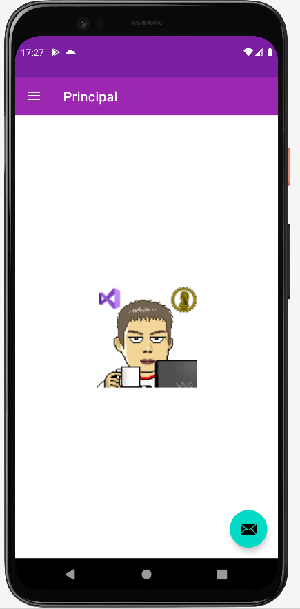
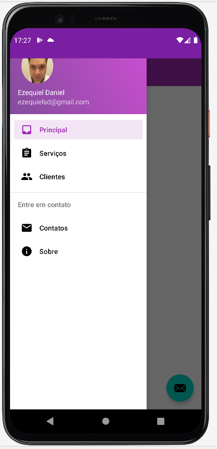
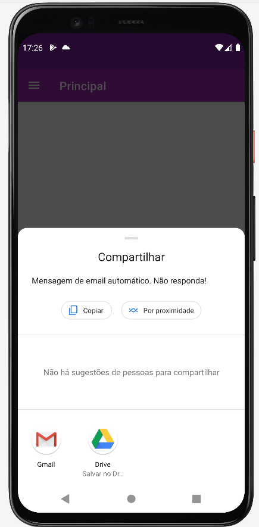
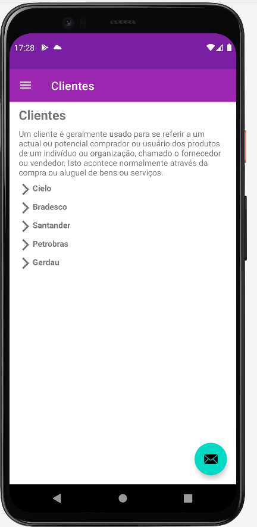

# Apresentação

Este é um aplicativo desenvolvido apresentar a aplicação de menu, chamada de app de email, entre outros.
Eu desenvolvi ele para aperfeiçoamento de conhecimento em aplicativos nativos para Android com exploração de componentes disponiveis no Android Studio.

## Recursos explorados no desenvolvimento do APP

* Navegation Drawer.
* Fragment.
* Chamada de app para envio de email, padrão configurado no celular, e passando as configurações.
* Evento click em ImageView.
* Utilização do componente android-about-page: https://github.com/medyo/android-about-page.
* Uso de Intent.
* Recuperação de parametro recebido na Activity, por Bundle.

| Tela Principal | Menu Drawer | Menu email | Menu Clientes | Menu Sobre |
| ------------ | ------------- | ------------- | ------------- | ------------- |
|  |  |  |  |  |

## Requisitos

* Gradle [https://gradle.org/](https://gradle.org/).
* Java.
* Android Studio mais recente, utilizado a versão Node ultima versão.
* Adb Devices, emulador ou aparelho fisico.